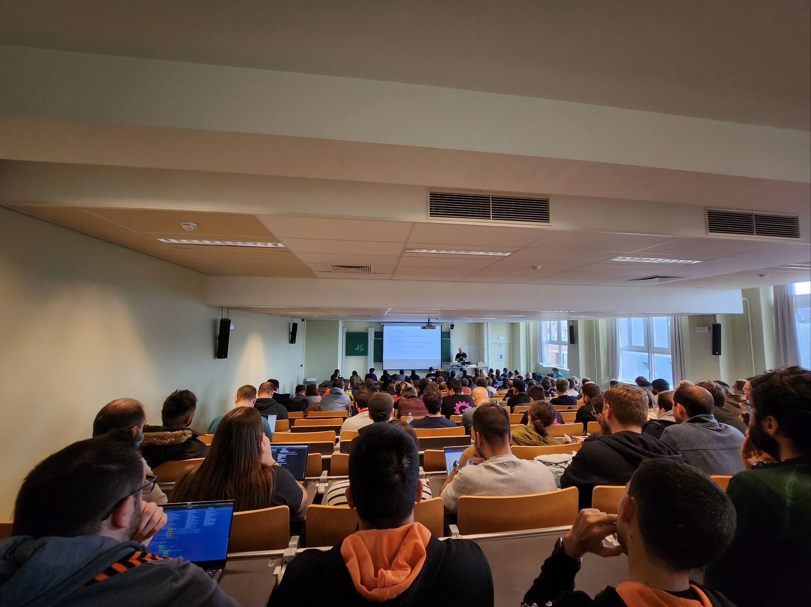
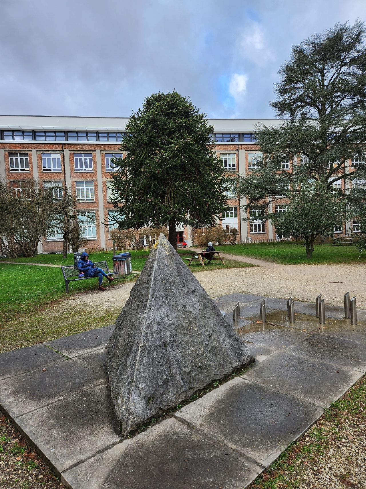

One friend told me that conferences are boring. It's maybe true (partly actually) if we will consider only the material of the talks. But, the conferences it's more than just talks: it's more about communication, networking.

Let's take as an example <a href="https://fosdem.org" target="_blank">FOSDEM</a>. It's a free large annual conference about free and open-source software and hardware. There are tons of talks there, a lot of tracks, and interesting stands for different projects. You have a chance to meet interesting enthusiastic people from all corners of the World and have endless chats, ask questions and encourage yourself to be part of it.

This year I've attended it for the second time offline. It was amazing. I'm already looking forward to the next one and getting ready to use dozens of takeaways from the past event.

Thank you, <a href="https://www.linkedin.com/in/aleksei-khlebaev-933950123/" target="_blank">Aleksei Khlebaev</a> that was with me these days!

Thank you, organizers, speakers, volunteers and participants. It was inspiring, hacky and atmospheric! 🥳

