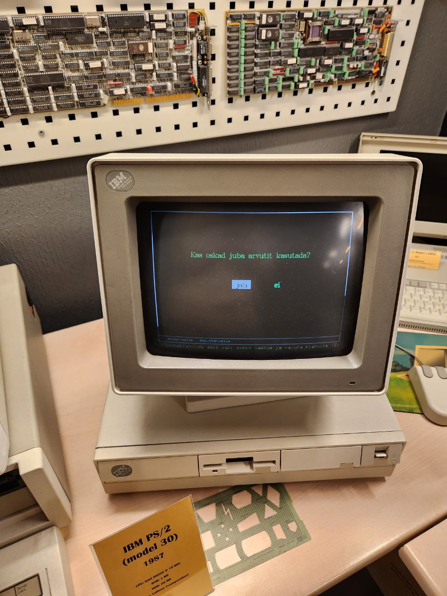
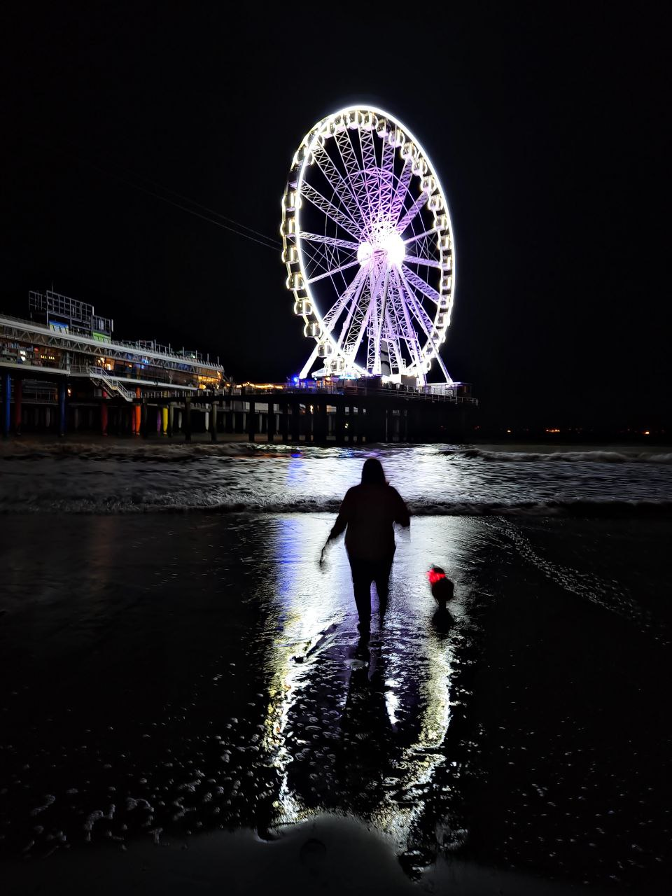
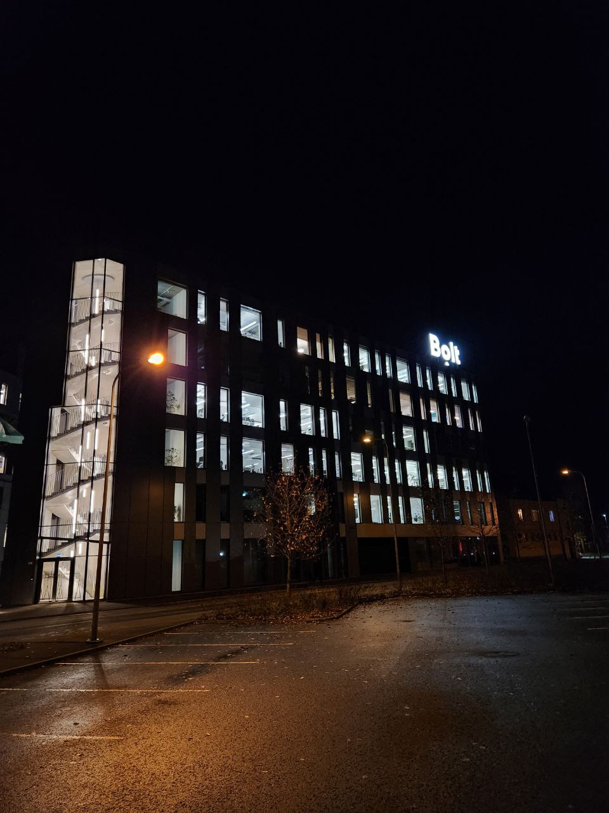

- For the first time visited [Egypt](https://www.openstreetmap.org/relation/1473947) 🇪🇬
- Switched from [iPhone ](https://support.apple.com/kb/SP779) to [Android 🤖](https://www.samsung.com/global/galaxy/galaxy-z-fold4/)
- Started [my Telegram channel](https://t.me/underoot)
- Finished B1 Estonian language course
- Passed A2 Estonian language exam. Yah, ma räägin eesti keelt!
- Visited [FOSDEM](/blog/2023/02/06/fosdem2023/)
- Had skiing in Estonia
- Enjoyed beautiful nature of Estonia
- Actively used [ChatGPT](https://chat.openai.com/) and [Copilot](https://github.com/features/copilot) for writing code 🤖
- Started [my Youtube channel](https://www.youtube.com/@underoot) (will continue soon)
- Bought an electric piano
- Bought vinyl for the first time, but haven't bought player yet
- Saw a beautiful astronomical event: [Moon near Venus and Pleiades](https://t.me/underoot/42)
- Visited [Helsinki](https://www.openstreetmap.org/relation/34914) in the summer
- Attended [HelsinkiJS](https://meetabit.com/events/helsinkijs-april-2023) in April
- Find out my favorite beverage: [Cream soda](https://nokianpanimo.fi/tuote/sunn-cream-soda/) from Nokian Panimo
- Visited [Italy](https://www.openstreetmap.org/relation/365331) with road trip on a rent car
- Attended [Estonian computer museum](https://arvutimuuseum.ee) during [night of museums](https://www.instagram.com/estonianmuseums/)
- Traveled to [Hijumaa](https://www.openstreetmap.org/relation/147194) to see lavender field
- Visited [tulip festival](https://www.visitestonia.com/en/kirna-manor-park) in Kirna manor park
- Reproduced physical experiment of [camera obscura](https://en.wikipedia.org/wiki/Camera_obscura)
- Participated in bike parade
- Was in camping for the night during summer
- Bought hand grinder for coffee
- Saw [Kaka, kevad ja teised](https://www.imdb.com/title/tt26762515), [The Super Mario Bros. Movie](https://www.imdb.com/title/tt6718170), [Barbie](https://www.imdb.com/title/tt1517268), [Napoleon](https://www.imdb.com/title/tt13287846) in cinema
- Observed nothern lights for the first time in my life
- Bought [a new car](https://en.wikipedia.org/wiki/Mazda_CX-5)
- Was disappointed in [Twitter](https://x.com)
- Visited 7 countries, alongside of Estonia, during the road trip in Europe
- Used 5G network for the first time
- Resigned from [Bolt](https://bolt.eu) 💚
- Started working in [Mapbox](https://mapbox.com) 🗺
- Participated in [Junction 2023 hackathon](https://t.me/underoot/112)
- Wrote a simple [browser game](https://underoot.dev/emerji/) about Emoji 😉
- Moved from [Intel-based](https://support.apple.com/kb/SP809) Macbook to [Apple Silicon-based](https://support.apple.com/kb/SP898) one
- Migrated to [Finland](https://www.openstreetmap.org/relation/54224)

See all of you in 2024! 🎉

I hope that it will bring us peace 🕊️ and happiness!

