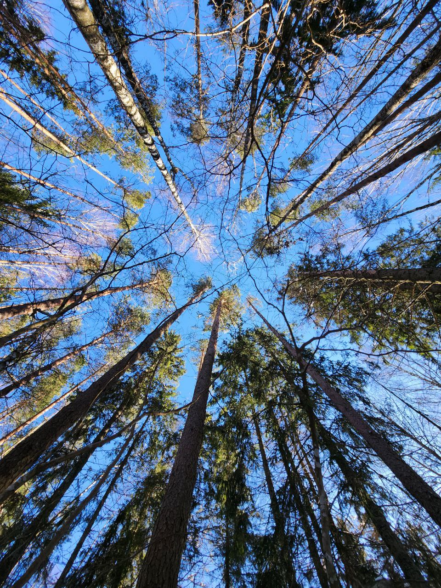

Was traveling today with my family near [Paunküla](https://osm.org/go/0xgBViQcX--?node=1973429338) on [the hiking trail](https://osm.org/go/0xKr2YL?relation=5424653) and enjoyed meditative sceneries in spring winter with shiny snow under the Sun, lakes, covered by ice, evergreen pines, and snowy slopes.

A full switch of environment helps to reboot before the next workweek!

